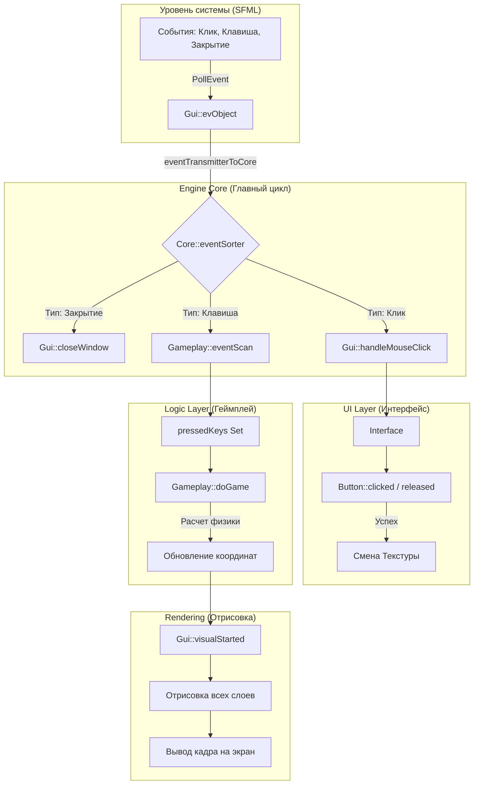
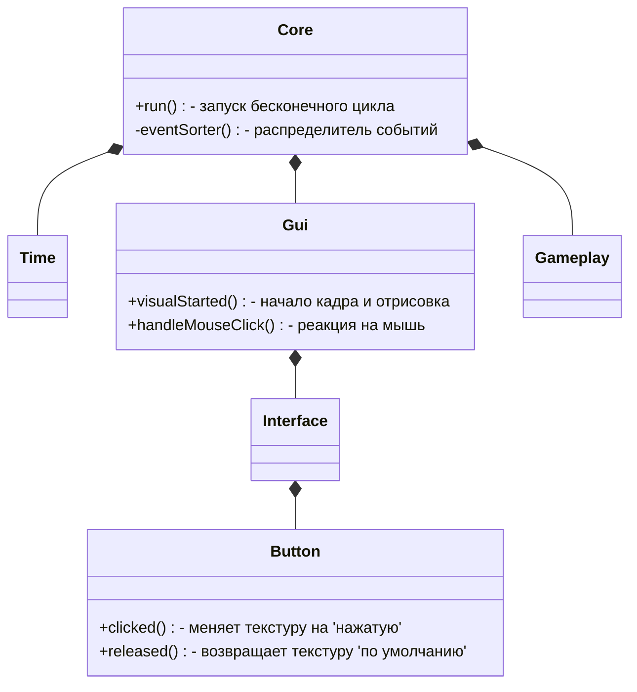

# Путеводитель по архитектуре GamakEngineProject

Этот документ поможет тебе вспомнить, как устроена логика твоего движка и как взаимодействуют его части.

## 🌟 Общая концепция: "Разделение ответственности"

Движок построен по принципу модульности. Каждая часть "знает" только о своей задаче:
1. **Core (Сердце):** Управляет тактами (циклом) и распределяет задачи.
2. **Gui (Глаза и Руки):** Взаимодействует с Windows (окно, мышь, клавиатура) и рисует картинку.
3. **Gameplay (Мозг):** Хранит правила игры и логику персонажей.
4. **Domain (Помощники):** Хранит общее (время, пути к файлам, константы).

---

## 🗺 Ментальная карта (Взаимодействие систем)

---

## 🛠 Разбор ключевых механик

### 1. Как работает ввод (Клавиатура)
Вместо того чтобы ловить нажатие клавиши один раз, движок использует **"Память кнопок"**:
* Когда ты нажимаешь `W`, она попадает в список `pressedKeys`.
* Пока ты её держишь, она там находится.
* Как только отпускаешь — она удаляется.
* **Результат:** В любой момент времени геймплей знает точно, какие кнопки зажаты прямо сейчас. Это позволяет плавно ходить по диагонали или прыгать во время бега.

### 2. Как работает UI (Кнопки)
Логика UI "пробрасывается" сверху вниз:
* **Core** видит событие клика.
* **Core** отдает координаты (X, Y) в **Gui**.
* **Gui** передает их текущей странице (**Interface**).
* **Interface** проверяет каждую свою **Button**: "Попал ли клик в твои границы?".
* **Button** сама меняет свой внешний вид (текстуру).

### 3. Управление временем (Time)
Движок считает время каждого кадра. Это нужно для того, чтобы:
1. Ограничивать FPS (чтобы видеокарта не "горела", считая тысячи кадров в секунду).
2. (В перспективе) Делать движение персонажей плавным: `скорость * время_кадра`. Так игра будет идти одинаково быстро на любом компьютере.

---

## 📐 Схема классов (UML)

---

## 🚀 Как добавить новую фичу?
* **Новая кнопка:** Добавь `mainPage.setButton(...)` в конструктор `Gui::Gui()`.
* **Новая клавиша (например, Пробел):** Добавь `if (pressedKeys.count(sf::Keyboard::Space))` в `Gameplay::doGame()`.
* **Новый экран меню:** Создай еще один объект `Interface` и переключайся между ними в `Gui`.
